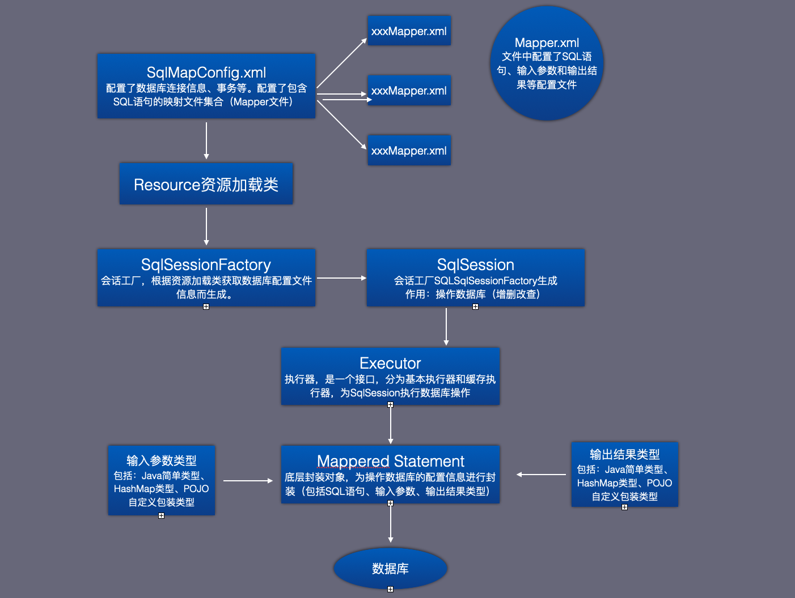

[toc]

## MyBatis介绍

是一款支持动态SQL语句的持久层框架，可以让开发人员将精力集中在SQL语句上。

- 将SQL语句配置在XML文件中，避免了JDBC在Java类中添加SQL语句的硬编码问题 
- 通过MyBatis提供的输入参数映射方式，将参数自由灵活的配置在SQL语句配置文件中，解决了JDBC中参数在Java类中手工配置的问题
- 通过MyBatis的输出映射机制，将结果集的检索自动映射成相应的Java对象，避免了JDBC中对结果集的手工检索
- 可以创建自己的数据库连接池，使用XML配置文件的形式，对数据库连接数据进行管理，避免了JDBC的数据库连接参数的硬编码问题

=> 采用配置文件动态管理SQL语句，并含有输入映射、输出映射机制以及数据库连接池配置的持久层框架。

## MyBatis整体架构

- 数据源配置文件
- SQL映射配置文件
- 会话工厂
- 会话
- 执行器
- 底层封装对象

运行流程：

- SqlSessionFactory会话工厂通过Resource资源信息加载对象获取SqlMapConfig.xml配置文件信息，产生可以与数据库进行交互的会话实例类SqlSession
- 会话实例类SqlSession根据Mapper配置文件中的SQL配置，去执行相应的增删改查操作。
- SqlSession内部，是通过执行Executor（分为基本执行器和缓存执行器）对数据库进行操作的。
- 执行器Executor与数据库交互，依靠的是底层封装对象Mappered Statement，封装了从Mapper文件中读取的信息（包括SQL语句、输入参数、输出结果类型）
- 通过执行器Executor与底层封装对象Mappered Statement的结合，MyBatis实现了与数据库进行交互的功能。

